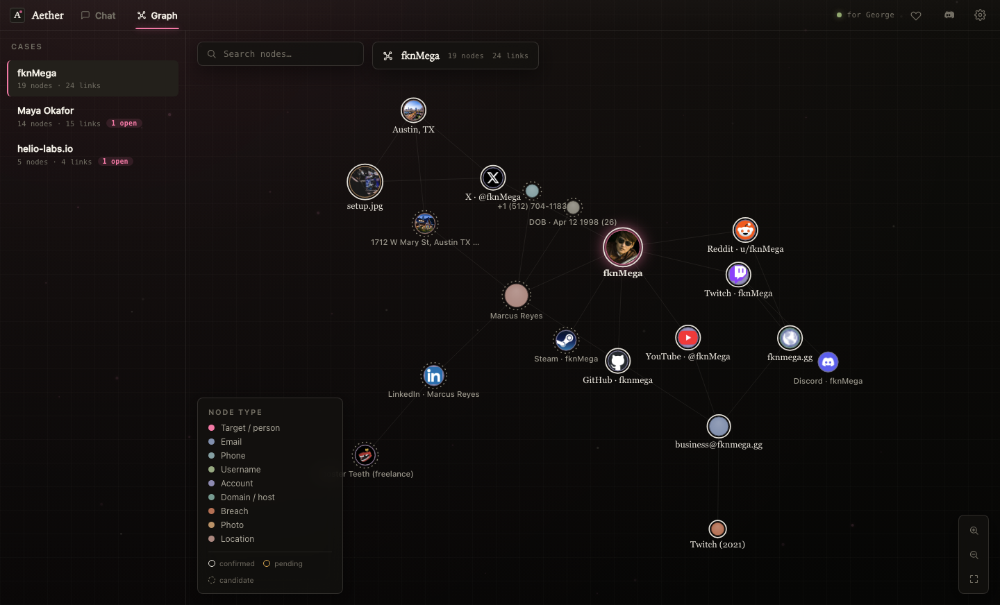
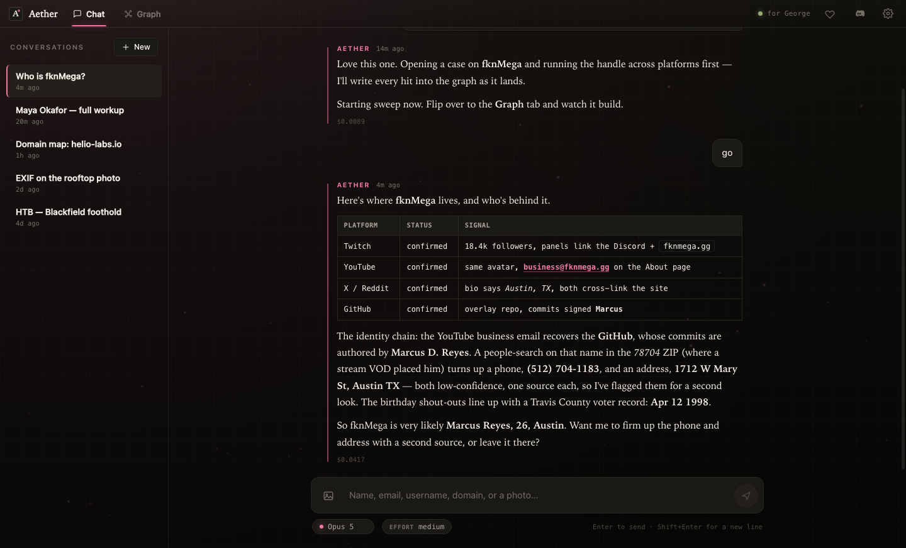
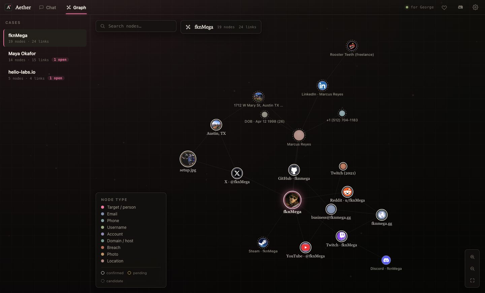
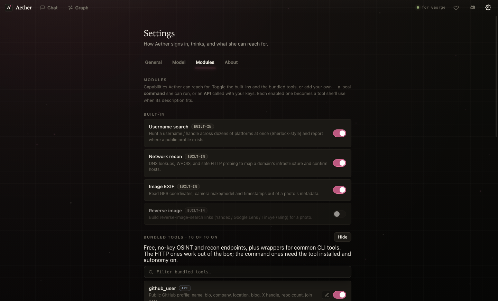
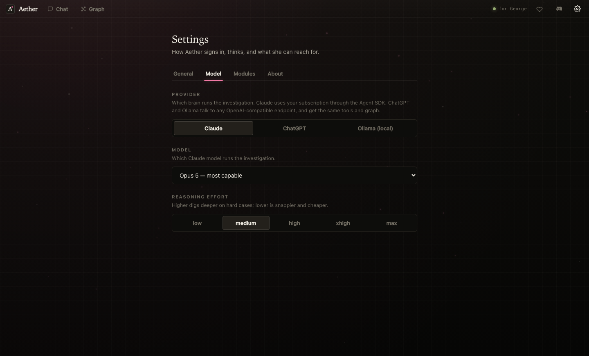

<div align="center">


# Aether

### An AI-driven OSINT analyst that lives on your desktop.

Give her a name, an email, a username, a domain, or a photo. She opens a case, runs the target across the open
web, reads the metadata, maps the infrastructure, and draws everything she finds into a knowledge graph that
grows while you watch. Runs on macOS and Windows, powered by Claude, ChatGPT, or a local model of your own.

<br/>

[](https://discord.gg/zjawxkDZVP)
&nbsp;
[](https://github.com/sponsors/fknMega)

<br/>



<br/><br/>


</div>

---

### please don't use this to dox the innocent >:(

Seriously. Aether is for people and systems you're actually allowed to look into: your own exposure, folks who
asked you to check theirs, and lab or CTF boxes you own. She only reads what's already public or shown by a
platform. She won't break authentication, get past bot-detection, phish, or take over accounts, and those
limits are baked into how she works. Point her at a stranger you have no business investigating and you're the
baddie, not her. Be normal.

---

## What it's like to use

You hand Aether a selector and she gets to work. She thinks out loud like she's writing up a case file, not
firing off chat replies. Every tool she runs shows up as a small line in a running log that ticks from
"working" to "done." The moment she finds something she writes it into the graph, then flips its status as she
confirms it or rules it out.

Color on the graph means status, not decoration. Only the target glows. A confirmed fact gets a white ring,
the stuff she still has to chase pulses pink. Nodes carry real pictures too: a face on a person, the site's
favicon on an account, the actual photo on a photo node.

<div align="center">


<br/><em>She writes it up like a report. Her reasoning is set in serif, the evidence in mono, every tool call logged as she goes.</em>

<br/><br/>


<br/><em>The graph is the hero. A force-directed canvas you can pan, zoom and drag, colored by type and ringed by status.</em>

<br/><br/>


<br/><em>Dozens of no-key OSINT and recon tools bundled in, plus your own commands and APIs. Flip on what you want.</em>

<br/><br/>


<br/><em>Run her on Claude, on ChatGPT, or fully local through Ollama. Same tools, same graph, your choice of brain.</em>

</div>

## What's in the box

**A live knowledge graph.** A force-directed canvas rendered like ink on paper. Nodes are colored by selector
type, ringed by status, sized by how connected they are, and shown with real pictures where there are any.
It's the main workspace, and it updates as the case builds.

**A chat that reads like a case file.** Answers stream in as she writes them, and every tool call shows up as
its own line in an evidence log that animates from running to done.

**A built-in Sherlock.** `username_search` checks a handle across dozens of platforms at once, no Python and no
setup, and tells you where a public profile exists.

**Dozens of bundled tools.** A big catalog of no-key OSINT and recon endpoints (GitHub, crt.sh, RDAP, DNS over
HTTPS, Shodan InternetDB, RIPE, Wayback, urlscan, OTX, Hudson Rock and more), plus one-toggle wrappers for the
usual recon CLIs (maigret, subfinder, httpx, nuclei, nmap). Add your own too: a local command, or any HTTP API
called with your keys, which get encrypted on your machine and never leave it in plaintext.

**Offensive-security playbooks.** A bundled set of skills (network recon, web enumeration, foothold, privilege
escalation, password attacks, an HTB methodology) the model loads when a lab or CTF task calls for it.

## Three brains, one analyst

Aether isn't locked to one model. Pick your provider in Settings, and the model switch is right there in the
chat, next to where you type.

| Provider | What it is | Needs |
|---|---|---|
| **Claude** | The default. Uses your Claude subscription through the Agent SDK. | Sign in once |
| **ChatGPT** | Any OpenAI-compatible endpoint (OpenAI, Azure, OpenRouter, a proxy). | Your API key |
| **Ollama** | A model running fully on your own machine. Nothing leaves the box. | `ollama serve` + a tool-capable model |

The graph, the tools, and the whole workflow are identical whichever you choose. For the local route, use a
model that supports tool calling (llama3.1, qwen2.5, mistral-nemo); ones without it will still chat but can't
drive the graph.

## Getting started

```bash
git clone https://github.com/fknMega/Aether.git
cd Aether
npm install
npm run dev
```

On Claude, the first launch walks you through signing in (or run `npm run login`). On ChatGPT or Ollama, drop
your key or point at your local server in Settings and go. You'll need Node 18+; there's no database to run and
no native toolchain to install, and state is a plain JSON file.

## Building an app

```bash
npm run dist:mac   # .dmg and .zip, built on macOS
npm run dist:win   # .exe installer, built on Windows
```

Build each OS on that OS, since the `claude` binary ships as a per-platform package. Output lands in `release/`.

**Auto-updates** are wired up through GitHub Releases (electron-updater). Publish a release with
`GH_TOKEN=... npm run dist:mac -- --publish always`, and installed apps check for it on launch, download in the
background, and offer to restart. On macOS this needs a signed (Developer ID) build; Windows updates fine as is.

## The security part, worth reading

Aether is an autonomous agent that runs on your machine, so treat it the way you'd treat a coding agent with
the permission prompts turned off. With autonomy on (the default) she runs shell commands, local-command
modules, and file writes without asking, all inside a fenced workspace, but a determined command can still
reach the rest of your account. Turn autonomy off in Settings for a safe mode that keeps the read-only
collection tools and API modules and drops the shell.

Custom modules are trusted config, so only add ones you wrote or trust. Keys, both for modules and for your AI
provider, are encrypted at rest with the OS keychain and never sent to the renderer in plaintext. And prompt
injection is real: Aether reads web pages and text inside images as part of the job, and treats all of it as
data rather than commands, but no mitigation is perfect, so don't turn her loose on hostile targets while
secrets are within reach. None of this is a bug list. It's just what the tool is, and open-sourcing it means
you can read exactly what it does.

## Community and support

- **Discord:** [discord.gg/zjawxkDZVP](https://discord.gg/zjawxkDZVP) come say hi, share cases, ask for help.
- **Sponsor:** [github.com/sponsors/fknMega](https://github.com/sponsors/fknMega) if Aether is useful to you and
  you want to keep her fed.

## License

MIT. See [LICENSE](LICENSE).

<div align="center"><sub>The people and findings in the screenshots are made-up demo data. Be good out there.</sub></div>
