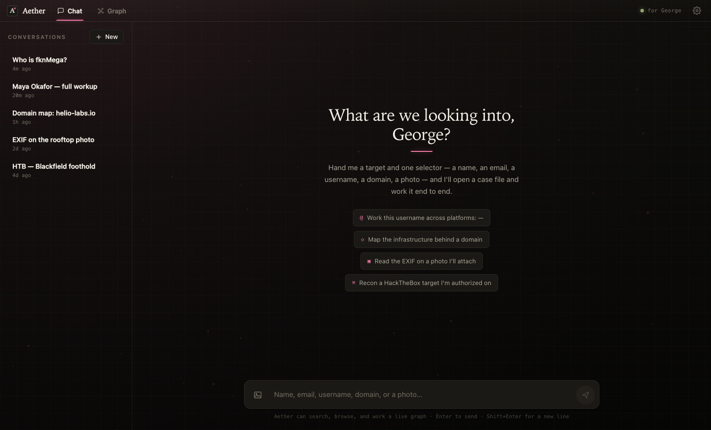

<div align="center">


# Aether

**An OSINT analyst that lives on your desktop.**

Give her a name, an email, a username, a domain, or a photo. She opens a case, runs the target across the
open web, reads the metadata, maps the infrastructure, and draws everything she finds into a knowledge graph
that grows while you watch. Runs on macOS and Windows. Powered by Claude.

<br/>


<br/>


</div>

> Authorized use only. Aether is meant for investigations you're actually cleared to run: your own exposure,
> consent-based work, and labs or CTF boxes you own. She reads what's public and platform-displayed. She won't
> break authentication, get past bot-detection, phish, or take over accounts, and those limits are written into
> how she works. Don't point her at people or systems you have no business investigating.

## What it's like to use

You hand Aether a selector and she gets to work. She thinks out loud like she's writing up a case file, not
firing off chat replies. Every tool she runs shows up as a small line in a running log that ticks from
"working" to "done." The moment she finds something she writes it into the graph, then flips its status as she
confirms it or rules it out.

Color on the graph means status, not decoration. Only the target glows. A confirmed fact gets a white ring,
the stuff she still has to chase pulses pink. Nodes carry real pictures too: a face on a person, the site's
favicon on an account, the actual photo on a photo node.

<table>
<tr>
<td width="50%"><br/><sub><b>Chat.</b> She writes it up like a report. The reasoning is set in serif, the evidence in mono.</sub></td>
<td width="50%"><br/><sub><b>Graph.</b> A force-directed canvas you can pan, zoom and drag. Nodes are colored by type and ringed by status.</sub></td>
</tr>
<tr>
<td width="50%"><br/><sub><b>Modules.</b> Flip the built-ins on or off, or add your own: a local command, or an API you call with your keys.</sub></td>
<td width="50%"><br/><sub><b>A fresh case.</b> Give her a target and one selector and she takes it from there.</sub></td>
</tr>
</table>

## What's in the box

**A live knowledge graph.** A force-directed canvas rendered like ink on paper. Nodes are colored by selector
type, ringed by status (confirmed, pending, candidate, excluded), sized by how connected they are, and shown
with real pictures where there are any. It's the main workspace, not an afterthought, and it updates as the
case builds.

**A chat that reads like a case file.** Answers stream in as she writes them. Every tool call, whether it's a
username hunt, a WHOIS, or a graph write, shows up as its own line in an evidence log that animates from
running to done.

**A built-in Sherlock.** `username_search` checks a handle across dozens of platforms at once, with no Python
and no extra setup, and tells you where a public profile exists.

**Recon tools.** `dns_lookup`, `whois`, `http_probe`, `exif_read` for GPS and camera metadata out of a photo,
and `reverse_image_urls` for Yandex, Google Lens, TinEye and Bing. Plus web search and fetch, and a fenced
shell and file workspace when she needs one.

**Modules you can configure.** Turn the built-in tools on and off, and add your own straight from Settings: a
local shell command, or an HTTP API you call with your own keys. Each one becomes a tool she'll reach for when
its description fits. Keys are encrypted on your machine and never leave it in plaintext. More on this below.

**Offensive-security playbooks.** A bundled set of skills (network recon, web enumeration, foothold, privilege
escalation, password attacks, an HTB methodology) that Claude loads when a lab or CTF task calls for it.

## Getting started

```bash
git clone https://github.com/fknMega/Aether.git
cd Aether
npm install
npm run dev
```

First launch checks that you're signed in to Claude. If you're not, the window walks you through it, or you
can run `npm run login`. After that, open Chat, give her a target, and switch to the Graph tab to watch it
build.

You'll need Node 18 or newer and a Claude subscription (or API access). Aether talks to Claude through the
[Claude Agent SDK](https://github.com/anthropics/claude-agent-sdk), which signs in once with your account.
There's no database to run and no native toolchain to install. State is a plain JSON file.

If you're poking at the interface, `npx vite --config vite.preview.config.mts` serves the UI at
`localhost:5199/preview.html` with a mocked backend and seed data, so you can work on it in a browser without
Electron or a Claude login.

## Building an app

```bash
npm run dist:mac   # .dmg and .zip, built on macOS
npm run dist:win   # .exe installer, built on Windows
```

The output lands in `release/`. Build each OS on that OS. The `claude` binary ships as a per-platform package,
so `npm install` grabs the right one for the machine you're on, and a cross-built package won't carry the other
platform's copy. Icons live in `build/`.

A locally built macOS app isn't notarized, so the first time you open it, right-click and choose Open (once),
or run `xattr -cr /Applications/Aether.app`.

## Modules

Everything Aether can reach for is a module, and you configure them in Settings under Modules.

| Kind | What it is | When it runs |
|---|---|---|
| Built-in | The native tools (username search, recon, EXIF, reverse image). Toggle them on or off. | either mode |
| Local command | A shell command you define, like `amass enum -d {input}`. Secrets are passed in as env vars. | autonomy on |
| API (HTTP) | A request to any endpoint, called with your keys, using `{{KEY}}` in the URL, headers, or body. | either mode |

`{input}` is the one thing Aether fills in, guided by the description you write. That description becomes the
tool's description, which is how she knows when to use it.

You can also drop in private modules without touching the repo. Put a `private/modules.json` in place (the
whole `private/` folder is gitignored) and its modules show up pre-configured with empty key fields:

```json
[
  {
    "id": "private-nesher",
    "name": "nesher",
    "kind": "http",
    "method": "GET",
    "description": "Search breach corpora for an email, username or phone and return matching records.",
    "inputLabel": "an email, username, phone, or domain",
    "url": "https://api.your-provider.example/v1/search?q={input}",
    "headers": [{ "name": "Authorization", "value": "Bearer {{NESHER_KEY}}" }],
    "secrets": [{ "name": "NESHER_KEY" }]
  }
]
```

Open Settings, find nesher under Modules, paste your key, and it's live. The key is encrypted with the OS
keychain and never gets sent to the renderer or to Claude in plaintext.

## How it fits together

```
Electron main (ESM)  ->  Claude Agent SDK  ->  Claude (your subscription)
  in-process MCP tools, JSON store, encrypted module keys, streaming IPC
  preload (contextBridge)  ->  React + Vite renderer (chat, graph, settings)
```

```
src/
  shared/      types and the IPC contract, shared by both sides
  main/        Electron main: the turn runner, tools, JSON store, modules, the prompt
    tools/     current_time, graph read/write, username_search, dns/whois/http, exif, image, custom modules
    modules.ts   the module store: built-in gating, custom command/API, encrypted secrets
    nodeImages.ts  fetches favicons, avatars and photos and hands the graph data URLs
  preload/     the typed window.aether bridge
  renderer/    the React UI: components, the d3-force graph, zustand state, theme.css
plugins/
  aether-offsec/   the offensive-security playbooks
```

The renderer never touches Node or the filesystem on its own. Everything goes over a typed, context-isolated
bridge. Claude's file and shell access is fenced to a workspace folder, and links open in your real browser
instead of inside the app.

## The security part, worth reading

Aether is an autonomous agent that runs on your machine, so treat it the way you'd treat Claude Code with the
permission prompts turned off.

With autonomy on (the default), she runs shell commands, local-command modules, and file writes without
asking. Her working directory is a fenced workspace, but a determined command can still reach the rest of your
account. Turn autonomy off in Settings for safe mode, which drops the shell and file writes and leaves the
read-only collection tools and API modules.

Custom modules are trusted config. A command module runs your shell, and an API module calls whatever endpoint
you point it at with your key, so only add ones you wrote or trust. Keys are encrypted at rest.

Prompt injection is a real risk. Aether reads web pages, documents, and text inside images as part of the job.
Her instructions treat all of that as data and never as commands, but no mitigation is perfect, so don't turn
her loose on hostile targets while autonomy is on and secrets are within reach.

`http_probe` and the image fetcher both refuse loopback, private, and link-local addresses, so they can't be
turned into an SSRF pivot into your own network.

None of this is a bug list. It's just what the tool is, and the whole point of open-sourcing it is that you can
read exactly what it does.

## License

MIT. See [LICENSE](LICENSE).

<div align="center"><sub>The people and findings in the screenshots are made-up demo data.</sub></div>
