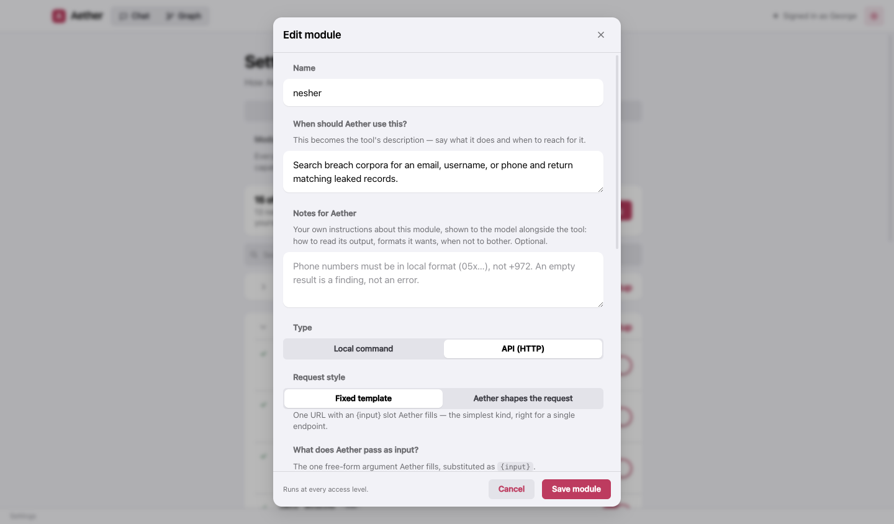
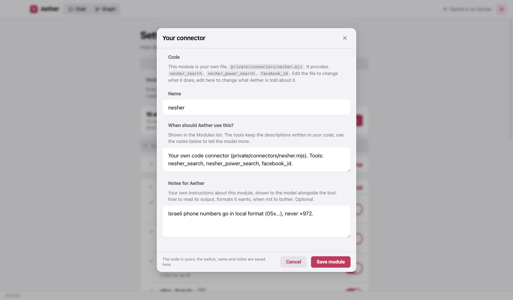
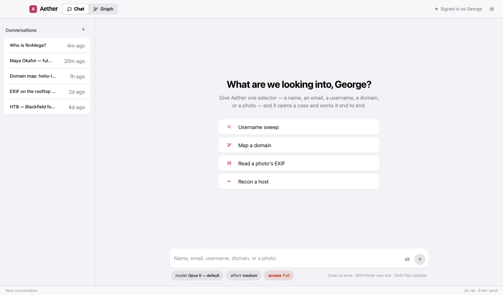

# Modules, tools and access levels

A **module** is a capability Aether can reach for. Some are built in (username search, network recon, EXIF,
reverse image). About sixty are bundled — roughly forty no-key OSINT endpoints (GitHub, crt.sh, RDAP, Shodan
InternetDB, Wayback, urlscan, OTX, …) and some twenty wrappers around the usual recon programs (maigret,
subfinder, httpx, nuclei, nmap, …). And you can add your own.

## Installing the bundled tools

A module that wraps a command-line program is only real once that program is installed. The switch is your
intent — *I want subdomain enumeration* — and installing is what Aether does to honour it: turning on a module
whose program is missing installs it first, then enables it. Nothing installs without that click, and nothing
ever runs as root; when the only route needs administrator rights, the row shows you the command to run yourself.


Where the tools come from:

| | macOS | Windows |
|---|---|---|
| Python tools (maigret, holehe, socialscan, wafw00f) | `pipx` (`brew install pipx`) | `py -m pipx` (Python from winget, then `py -m pip install --user pipx`) |
| Go tools (httpx, subfinder, nuclei, dnsx, naabu, katana, tlsx, cdncheck, gau, waybackurls, assetfinder, webanalyze) | Homebrew, else `go install` | `go install` (Go from winget, or `scoop install go`) |
| nmap, sslscan, amass | Homebrew | Scoop |
| wpscan | Its official Homebrew tap, else `gem` | `gem` with Ruby + DevKit |
| WhatWeb, Nikto | Homebrew (Nikto); a clone for WhatWeb | Shown as a clone-and-run route |

If a route fails, Aether tries the next one it can run before giving up, and the row says what actually went
wrong — a missing package manager comes with the one line that installs it.

## Your own modules

**Add your own module** at the bottom of the pane. Three kinds:

- **A local command.** `maigret {input} --timeout 8` — the one free-form argument Aether fills is substituted,
  safely quoted, for `{input}` (and is in the environment as `AETHER_INPUT`). Write `{input}` on its own or as
  `"{input}"`; inside a longer quoted string it is refused, because the quotes would cancel out. Runs in Aether's
  workspace; withheld at Safe access, approved per run at Ask. On Windows it runs in PowerShell.
- **An API, fixed template.** One URL with an `{input}` slot, your headers, and keys referenced as `{{KEY}}`.
- **An API, shaped by Aether.** For an API with many endpoints: you give the base URL, headers and keys, and Aether
  chooses the path, method, query and body itself. It can only ever call the host in your base URL — a request
  that would leave it is refused before it is sent — and a key you put in the base URL's query string stays on
  every request and cannot be overridden.



Two things every module has:

- **Notes for Aether** — your own instructions, shown to the model right next to the tool: how to read the output,
  the format it wants, when not to bother. Built-in modules take notes too.
- **Try it** — send one request, or run the command once, with a sample input and see exactly what the model would
  get. Uses the keys as typed; nothing is saved.

Keys are stored encrypted on your machine (the OS keychain when available), never shown again, and never sent to the
renderer or to the model in plaintext. A command module's process gets only its own keys in its environment — not
the other modules', not yours.

### Code connectors

A connector is a plain ES module in the connectors folder — `private/connectors/` in a source checkout, or
`<app user-data folder>/private/connectors/` in an installed build — named `*.mjs` (or `*.js`). Its default export
(or a named export `register`) is a factory that returns tools:

```js
// private/connectors/example.mjs
export default function ({ tool, z, config }) {
  // `tool` is the Claude Agent SDK helper, `z` is zod, `config.timezone` is the app's timezone.
  return [
    tool("example_lookup", "Look a thing up in my own service.", { q: z.string() }, async ({ q }) => ({
      content: [{ type: "text", text: JSON.stringify(await myLookup(q)) }],
    })),
  ];
}
```

Every such file appears here too, under **Your modules**, as a module of its own: a switch, a name, a description,
and notes for Aether. The code is yours to edit on disk; everything Aether is *told* about it is edited here. A
file that fails to load keeps its switch and notes for when it works again.



## Access levels

What Aether may do on this machine — whichever model is driving. The picker under the chat sets it, and so does
**Settings → General**. **Shift+Tab** in the message box toggles between Safe and Ask.

| Level | What it means |
|---|---|
| **Safe** | Collection only. Search, recon, the graph and reading public pages. No shell, no file writes, no installing. |
| **Ask** *(default)* | Aether may request the shell, a URL it chose, a command module or a tool install — and each one is put to you, with the exact command or URL shown in full. Refusing is an answer; it says what it would have done and carries on. |
| **Full** | No prompts. Everything Safe withholds is simply allowed. Aether reads pages written by the people it investigates, so choose this deliberately. Full is never reached by a keystroke — only by picking it. |



"Don't ask again" on a prompt lasts for the session and is never written to disk; changing the level retires any
grant made under the old one. And whatever the level, the boundaries hold: commands run in an OS sandbox on macOS,
reads cannot leave Aether's workspace, and SSH keys, cloud credentials, browser profiles, shell history and
Aether's own settings are off-limits everywhere.


