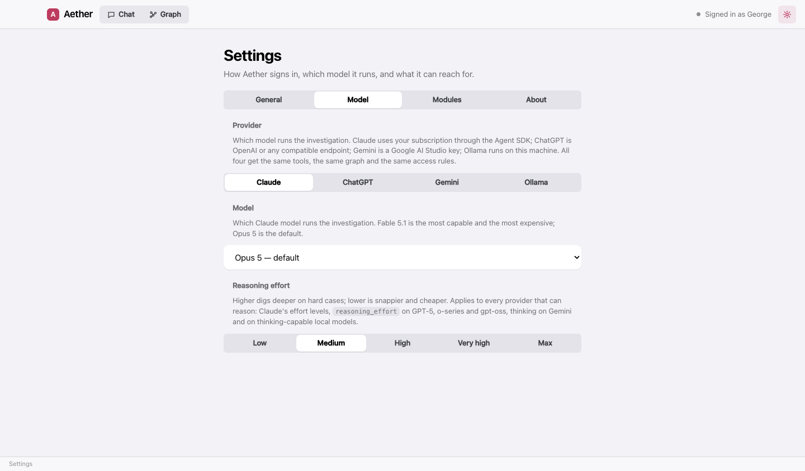
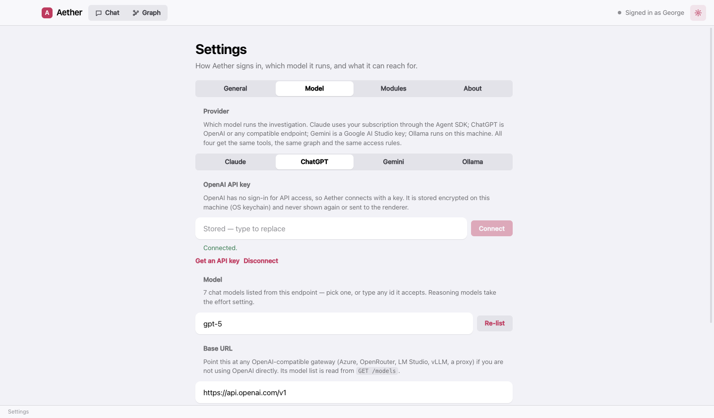
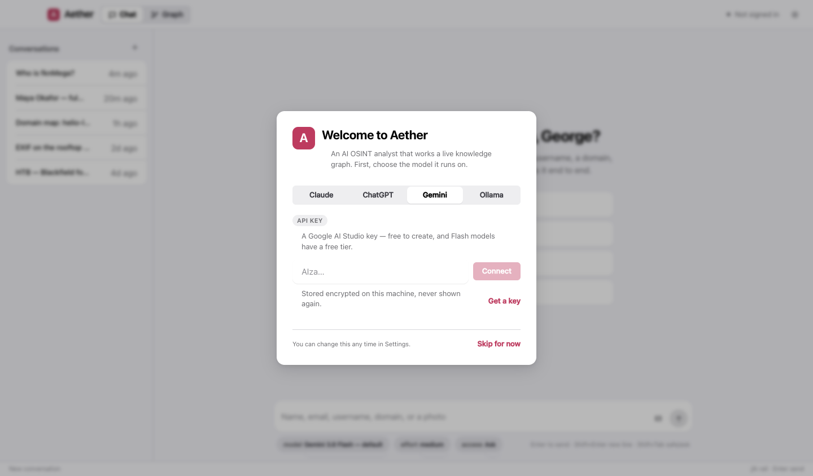

# Choosing and connecting a model

Aether runs on four brains. The graph, the tools, the access rules and the whole workflow are identical whichever
you pick; what changes is capability, cost, and where your data goes. Switch in **Settings → Model**, or pick a
model straight from the chat — the picker under the message box always shows the active provider's models.

| Provider | Best for | Needs | Data goes to |
|---|---|---|---|
| **Claude** | The strongest analyst; the default | A Claude Pro or Max subscription, signed in once | Anthropic |
| **ChatGPT** | OpenAI's models, or any OpenAI-compatible endpoint | An API key | OpenAI (or your gateway) |
| **Gemini** | A free tier that does real work | A Google AI Studio key | Google |
| **Ollama** | Nothing leaves the machine | A tool-capable local model | Nowhere |

## Claude

Aether drives Claude through the Agent SDK on your subscription. Sign in once from the first-run screen or
**Settings → General**; a browser window opens and the app picks the login up when it completes.

Models: **Fable 5.1** (most capable, and the most expensive of your plan's allowance), **Opus 5** (the default),
**Sonnet 5** (balanced), **Haiku 4.5** (fastest). The **effort** pick sets how deeply the model reasons; Haiku
has no effort setting.

## ChatGPT (OpenAI and compatible endpoints)

Paste an API key from [platform.openai.com/api-keys](https://platform.openai.com/api-keys). Once connected, the
model picker lists what the endpoint actually serves — pick from it or type any model id it accepts.

Against OpenAI itself, Aether uses the Responses API, which is what lets the current models (GPT‑5.6, GPT‑6)
reason *and* call tools in the same turn. Point the **Base URL** at OpenRouter, Azure, LM Studio, vLLM or a proxy
to use those instead; Aether speaks Chat Completions to them and lists their models the same way.

## Gemini

Create a key at [aistudio.google.com/apikey](https://aistudio.google.com/apikey) — it is free, and the Flash models
have a free daily allowance that is enough for real cases. Paste it and **Connect**; the picker then lists the
models available to that key. **Gemini 3.8 Flash** is the default; **3.1 Pro** when it matters.

## Ollama

Install Ollama, pull a model, press **Scan**. Aether lists every pulled model with what it can do — **tools**,
**thinking**, **vision** — how much context it was built for, and which one is loaded right now. A model without
tool calling is labelled *no tools*: it can chat, but it cannot search or write the graph, and the chat warns you
before you send.

Good local choices: `qwen3`, `qwen3.5`, `gemma4`, `gpt-oss`, `llama3.1`, `mistral-small3.2`. Aether asks Ollama for a
32k context window (or the model's own baked-in `num_ctx` if larger) so its brief and tools fit; set `OLLAMA_NUM_CTX`
in the environment to change that.

## The picks under the chat

- **model** — the active provider's models; live-listed where the provider can list them.
- **effort** — low to max. Steers Claude's effort, `reasoning_effort` on GPT and o-series models, and thinking on
  Gemini and thinking-capable local models.
- **access** — Safe, Ask or Full: what Aether may do on this machine without asking. See
  [modules and access](modules.html#access-levels).
