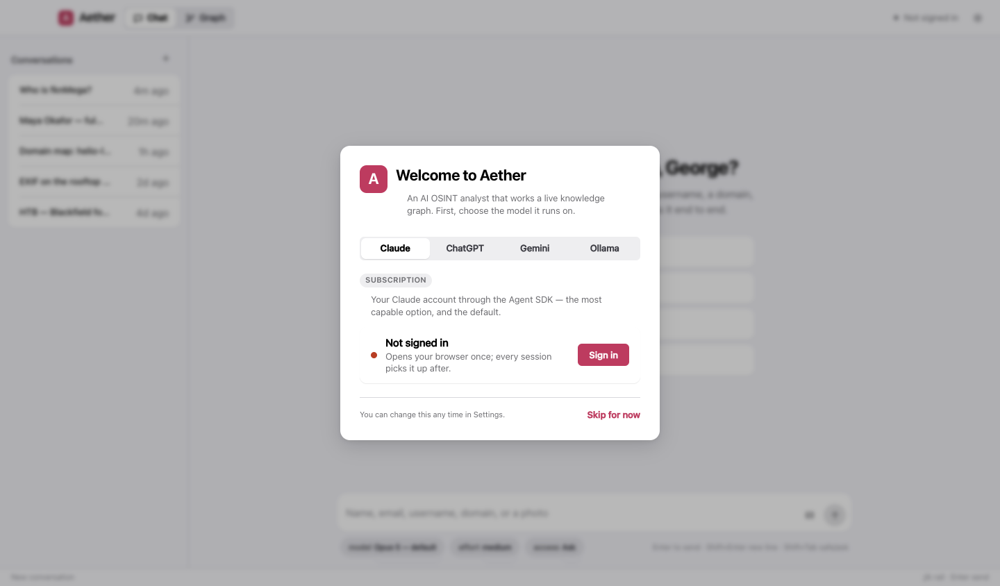
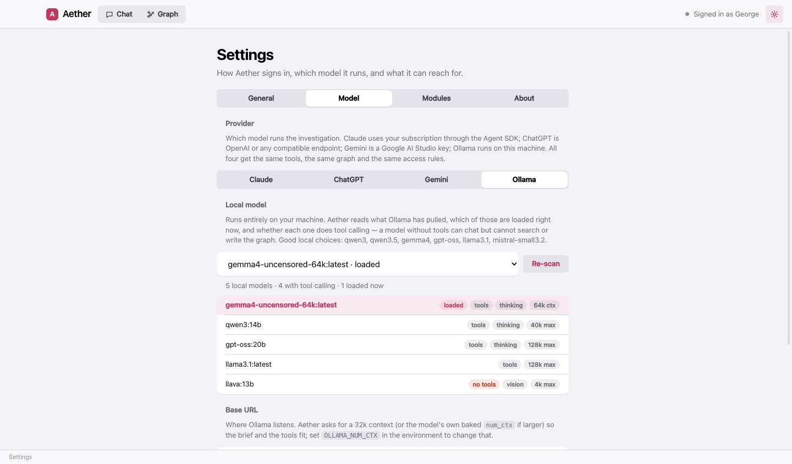
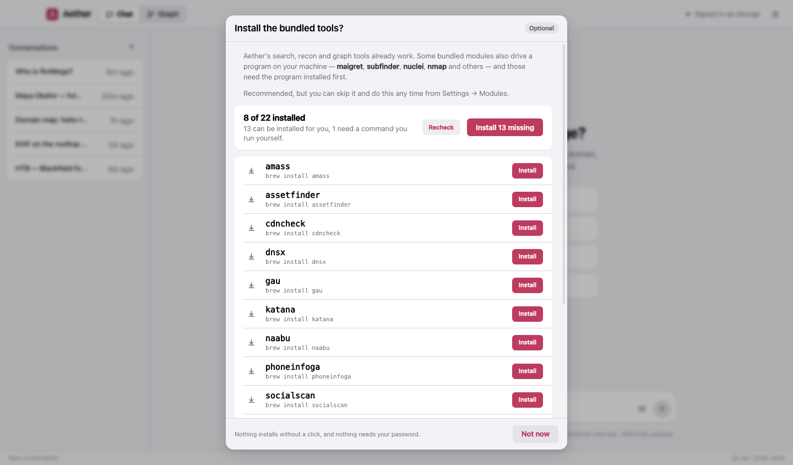
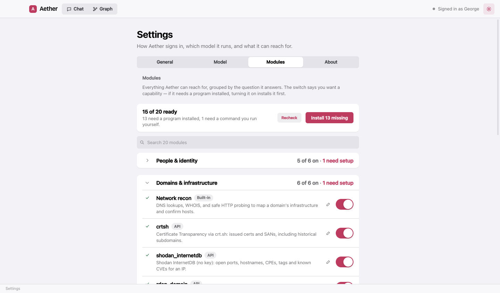
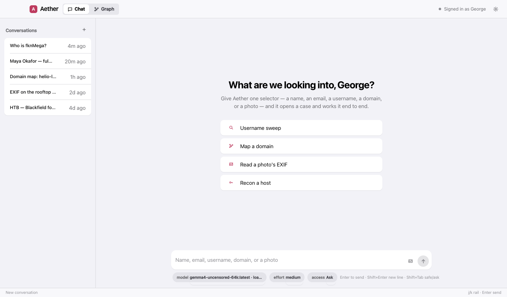
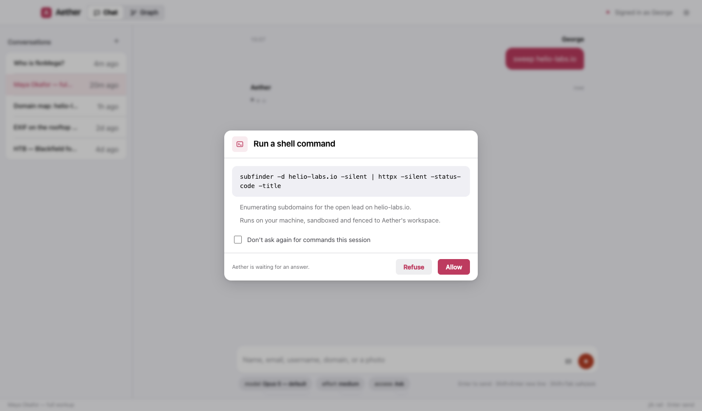

# Aether on macOS

Ten minutes, start to first case. Everything below is done as your normal user — Aether never asks for your
password, and neither does anything it installs.

**Works on:** macOS 13 Ventura or newer, Apple Silicon or Intel.

## 1. Install the app

1. Download the latest `Aether-x.y.z-arm64.dmg` (Apple Silicon) or `Aether-x.y.z.dmg` (Intel) from
   [GitHub Releases](https://github.com/fknMega/Aether/releases).
2. Open the disk image and drag **Aether** into **Applications**.
3. First launch: if macOS says the app "cannot be opened because Apple cannot check it", right-click **Aether** in
   Applications, choose **Open**, and confirm. You only do this once.

Prefer to run from source? You need Node 18 or newer (`brew install node`):

```bash
git clone https://github.com/fknMega/Aether.git
cd Aether/app
npm install
npm run dev
```

## 2. Choose a model

The first screen asks one thing: which model Aether should think with. Pick one and set it up right there —
the screen steps aside the moment that backend is reachable. You can change it any time in **Settings → Model**.



| If you have… | Pick | Then |
|---|---|---|
| A Claude subscription (Pro or Max) | **Claude** | **Sign in** opens your browser once; come back when it's done |
| An OpenAI API key | **ChatGPT** | Paste the key and **Connect** |
| A Google account | **Gemini** | Get a free key at [aistudio.google.com/apikey](https://aistudio.google.com/apikey), paste it, **Connect** |
| Nothing, and you'd rather keep it local | **Ollama** | See below |

Details for each — models, effort, what they cost — are on the [providers page](providers.html).

### Running fully local with Ollama

Nothing leaves your machine. Ollama needs a model that supports **tool calling** — that is what lets Aether
search and write the graph rather than just chat.

```bash
brew install ollama          # or download from https://ollama.com
ollama serve                 # leave this running (Ollama.app does this for you)
ollama pull qwen3            # a tool-capable, thinking model; gemma4, gpt-oss and llama3.1 also work
```

Then in Aether pick **Ollama** and press **Scan**. Every model you have pulled is listed, marked with what it can do
and which one is loaded right now.



Aether asks Ollama for a 32k context window (or the model's own baked-in size if larger) so that its brief and
tools fit. On a Mac with 16 GB, models up to about 14B parameters run comfortably.

## 3. The tools (optional, recommended)

After the model, Aether offers to install the command-line tools its bundled modules wrap. It is one button, it
is optional, and it never runs on its own.



Most tools come from **Homebrew**; a few Python ones use **pipx** and a few Go ones use **go install**. Install
what you don't have first:

```bash
/bin/bash -c "$(curl -fsSL https://raw.githubusercontent.com/Homebrew/install/HEAD/install.sh)"   # Homebrew
brew install pipx go
```

Everything can also be done later, one module at a time, from **Settings → Modules**: turning on a module whose
program is missing installs it first.



Two tools want a note:

- **WhatWeb** isn't packaged for macOS — it is a Ruby program you clone. Aether shows you the exact command;
  or use **webanalyze**, which installs itself and fingerprints technologies the same way.
- **wpscan** builds from source through its official tap and needs a working C toolchain. If it fails with
  "Failed to build gem native extension", update the Command Line Tools: `xcode-select --install`, or install
  the Xcode that matches your macOS.

## 4. Your first case

Type a selector into the chat — a handle is a good first one — and watch the **Graph** tab fill in. The three
picks under the message box are the **model**, the reasoning **effort**, and the **access** level: what Aether may
do on this machine without asking.



The default access level is **Ask**: Aether can reach for the shell, fetch a URL it picked, or install a bundled
tool, and each request comes to you with the exact command shown in full. **Shift+Tab** in the message box
toggles Safe and Ask.



Commands run in an OS sandbox (Seatbelt), file reads cannot leave Aether's workspace, and your credentials —
SSH keys, browser profiles, cloud tokens — stay off-limits at every level.

## Troubleshooting

**"Homebrew … Couldn't find manifest matching bottle checksum."** Homebrew's metadata is out of step with its
downloads; Aether already retries after a `brew update`. If it persists (a macOS beta, or a Homebrew development
build), run `brew update-reset`, or let Aether try the next route — it does so on its own.

**"The following taps are not trusted."** Homebrew 6 loads nothing from a third-party tap you haven't trusted.
Aether installs tap formulae by their full name (`wpscanteam/tap/wpscan`), which trusts just that formula. The
warning about *other* taps on your machine is Homebrew talking about them, not about the install in hand.

**A tool is installed but Aether says it isn't.** GUI apps don't see your shell's PATH. Aether repairs its own
PATH at start (Homebrew, `~/.local/bin`, `~/go/bin`, gem bin dirs) and asks your login shell for the rest. If you
installed something in an unusual place, add it to your shell's PATH and restart Aether.

**Sign-in to Claude never completes.** Run `npm run login` from the `app` folder (source install) or check
that the browser window finished; **Settings → General → Recheck** re-reads the status, and the pane re-reads it
on its own each time you open it.
