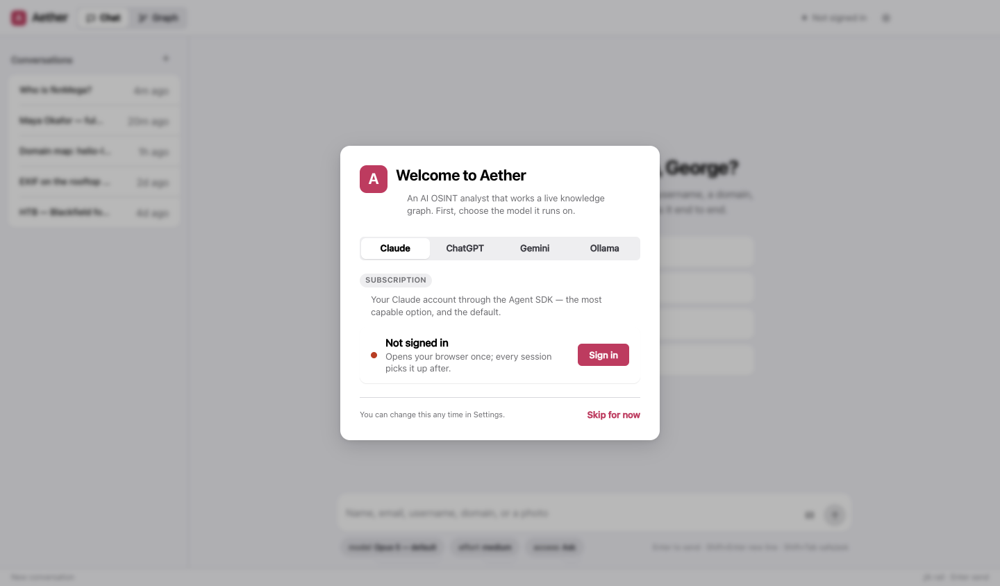
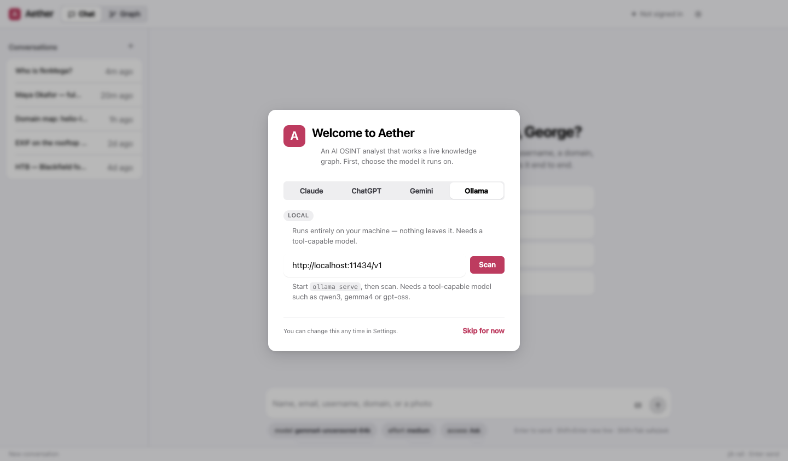
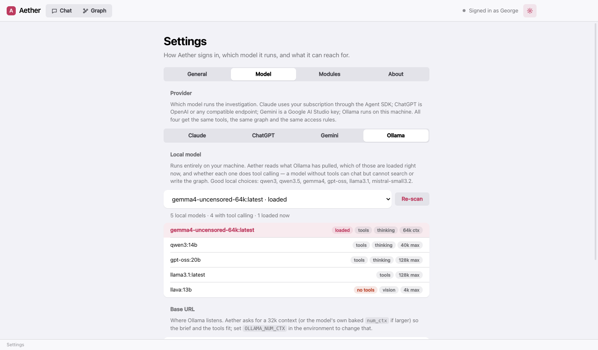
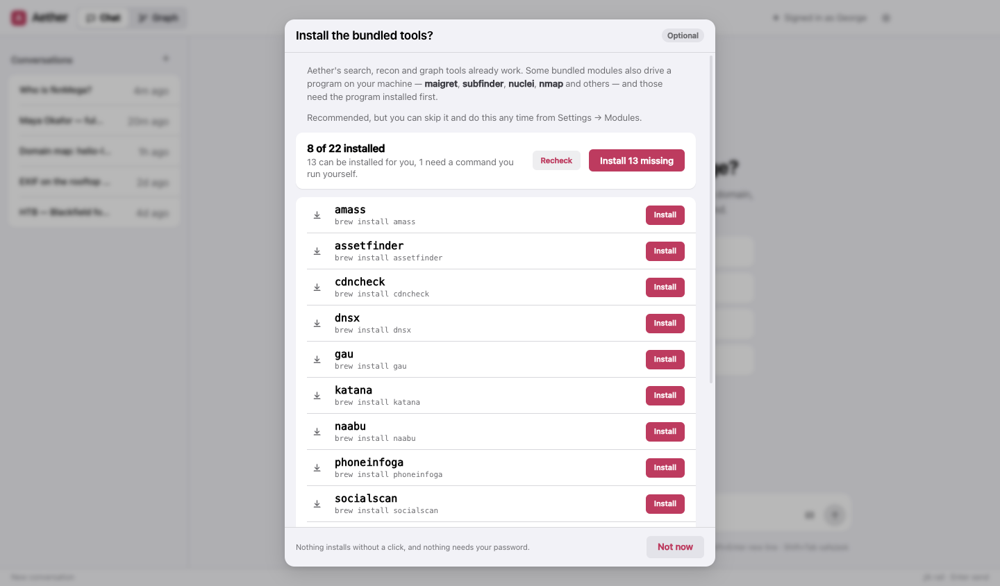
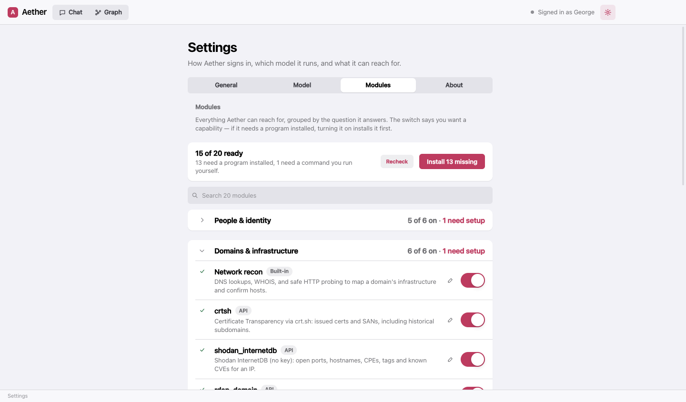
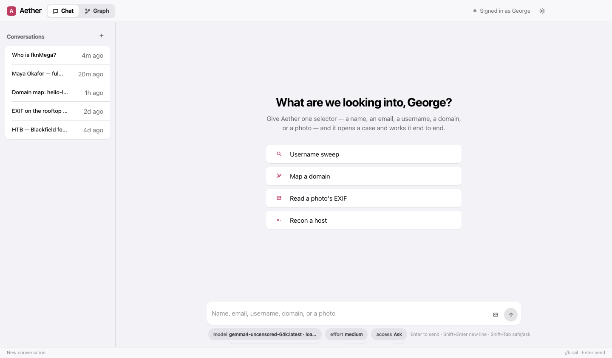
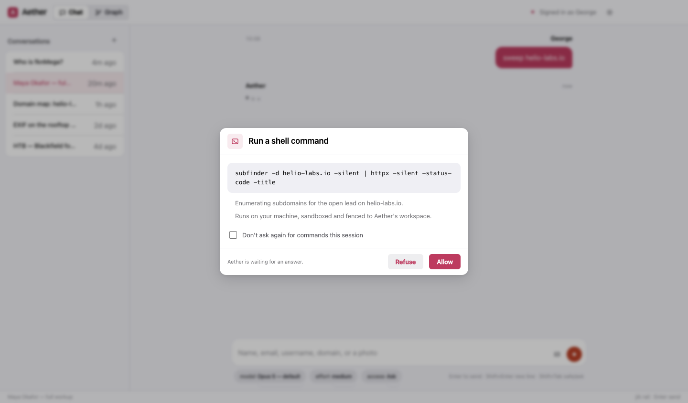

# Aether on Windows

Ten minutes, start to first case. Everything below works as a normal user; the two places Windows itself insists
on an administrator prompt (Go's installer, Npcap) are called out, with a no-admin alternative where one exists.

**Works on:** Windows 10 (1809+) and Windows 11, 64-bit.

## 1. Install the app

1. Download `Aether Setup x.y.z.exe` from [GitHub Releases](https://github.com/fknMega/Aether/releases).
2. Run it. If SmartScreen shows "Windows protected your PC", click **More info → Run anyway** — the installer is
   not code-signed yet.
3. Pick an install folder (the default is fine) and finish. Aether appears in the Start menu.

Prefer to run from source? Install Node LTS and Git, then:

```powershell
winget install -e --id OpenJS.NodeJS.LTS
winget install -e --id Git.Git --scope user
git clone https://github.com/fknMega/Aether.git
cd Aether/app
npm install
npm run dev
```

## 2. Choose a model

The first screen asks one thing: which model Aether should think with. Pick one and set it up right there — the
screen steps aside the moment that backend is reachable. You can change it any time in **Settings → Model**.



| If you have… | Pick | Then |
|---|---|---|
| A Claude subscription (Pro or Max) | **Claude** | **Sign in** opens your browser once; come back when it's done |
| An OpenAI API key | **ChatGPT** | Paste the key and **Connect** |
| A Google account | **Gemini** | Get a free key at [aistudio.google.com/apikey](https://aistudio.google.com/apikey), paste it, **Connect** |
| Nothing, and you'd rather keep it local | **Ollama** | See below |

Details for each — models, effort, what they cost — are on the [providers page](providers.html).

### Running fully local with Ollama

Nothing leaves your machine. Ollama needs a model that supports **tool calling** — that is what lets Aether search
and write the graph rather than just chat.

```powershell
winget install -e --id Ollama.Ollama       # installs and starts Ollama (it lives in the tray)
ollama pull qwen3                          # a tool-capable, thinking model; gemma4, gpt-oss and llama3.1 also work
```

Then in Aether pick **Ollama** and press **Scan**.



Every model you have pulled is listed — in the first-run screen and in **Settings → Model** — marked with what it
can do and which one is loaded right now.



A GPU with 8 GB of memory runs 8B-class models well; 12B–14B models want 12–16 GB. Aether asks Ollama for a 32k
context window so that its brief and tools fit.

## 3. The tools (optional, recommended)

After the model, Aether offers to install the command-line tools its bundled modules wrap. It is one button, it is
optional, and it never runs on its own.



On Windows the tools come from three places, none of which Windows ships with. Install the ones you want first, in
a PowerShell window (no administrator needed except where noted):

```powershell
# Python + pipx — for maigret, holehe, socialscan, wafw00f
winget install -e --id Python.Python.3.13 --scope user
py -m pip install --user pipx
py -m pipx ensurepath

# Go — for httpx, subfinder, nuclei, dnsx, naabu, katana, tlsx, cdncheck, gau, waybackurls, assetfinder, webanalyze
winget install -e --id GoLang.Go            # asks for administrator rights
#   … or, without administrator rights:
Set-ExecutionPolicy -ExecutionPolicy RemoteSigned -Scope CurrentUser
irm get.scoop.sh | iex
scoop install go

# Scoop — also the route for nmap, sslscan, nuclei and amass on Windows (see above to install it)
```

Close and reopen Aether after installing these, so it sees the new PATH. Then, in **Settings → Modules**, turning
on a module whose program is missing installs it — and the row tells you which prerequisite is missing when one is.



Things to know on Windows:

- **nmap and naabu need Npcap** to capture packets. Npcap has no silent installer and always asks for administrator
  rights, so it stays a one-time step of yours: run the `npcap.exe` that comes with nmap
  (`%USERPROFILE%\scoop\apps\nmap\current\npcap.exe`), or get it from [npcap.com](https://npcap.com).
- **wpscan** needs Ruby with its DevKit: `winget install -e --id RubyInstallerTeam.RubyWithDevKit.3.4 --scope user`,
  a new terminal, then `gem install wpscan --no-document`. Upstream doesn't officially support Windows.
- **WhatWeb** and **Nikto** are Ruby and Perl scripts with no Windows package. Aether shows the clone-and-run
  route in the module's row; **webanalyze** (installable) covers technology fingerprinting.
- **Command modules run in PowerShell**, not cmd.exe — so a module's command uses PowerShell syntax, the input
  arrives as a single-quoted literal in place of `{input}`, and keys are available as `$env:NAME`. An input
  containing `"`, `&`, `|`, `<`, `>`, `^`, `%` or `!` is refused on Windows: PowerShell cannot pass those to a
  program safely, so Aether asks the model to rephrase rather than guess.

## 4. Your first case

Type a selector into the chat — a handle is a good first one — and watch the **Graph** tab fill in. The three picks
under the message box are the **model**, the reasoning **effort**, and the **access** level: what Aether may do on
this machine without asking.



The default access level is **Ask**: Aether can reach for the shell, fetch a URL it picked, or install a bundled
tool, and each request comes to you with the exact command shown in full. **Shift+Tab** in the message box toggles
Safe and Ask.



One honest difference from macOS: **Windows has no OS-level sandbox** for the shell Aether runs. The workspace
fence, the credential deny-list and the access levels all apply, but there is no kernel underneath them the way
Seatbelt is on a Mac. Stay on **Ask** (the default) unless you have a specific reason not to, and read what a
prompt shows you before allowing it.

## Troubleshooting

**A tool installed fine but Aether says it's missing.** Aether reads PATH when it starts. After installing Python,
Go or Scoop, close Aether and open it again. It also looks in the usual places on its own (`%USERPROFILE%\.local\bin`
for pipx, `%USERPROFILE%\go\bin` for Go, `%USERPROFILE%\scoop\shims` for Scoop).

**A module's row says "Install Python and pipx first: …", "Install Go first: …" or "Install Scoop first: …".**
That line is the exact command for the one package manager the module needs. Run it, reopen Aether, press
**Recheck**. A few tools (nmap's Npcap, nikto, wpscan, whatweb, phoneinfoga) have no Windows package at all;
their row starts "Install … yourself" and gives the download or clone steps instead.

**`pipx` isn't recognised in my terminal.** `py -m pipx ensurepath`, then a new terminal. Aether calls pipx through
`py -m pipx` itself, so it works either way.

**The Claude sign-in opened nothing.** Sign in from a terminal in the `app` folder with `npm run login` (source
install), then **Settings → General → Recheck** (the pane also re-reads the status each time you open it).
